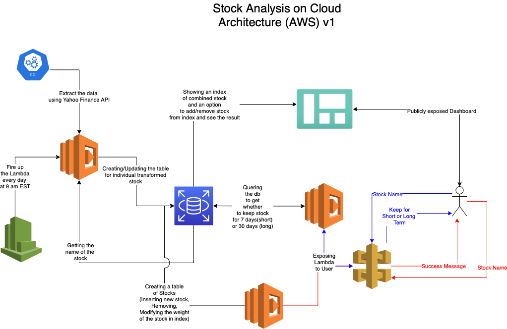

# TechStockAnalysis

## Status: 

IN - PROGRESS

## Aim: 

To create a custom index which tracks major tech stocks such as Microsoft, Amazon, Google, Facebook, etc by building an automated data pipeline using yfinance package and hosting on AWS platform.

## Current Progress:

1) Creating py executable file which creates stock csv having info about stocks and the weight for creating Index

## High Level Architecture

## Finished Part

- [x] stockDataExtract.py takes argument as stock symbol and produces csv.
This will be used as base for making lambda function, interacting with SNS Topic, RDS and API Gateway as shown above.

## Resources Used:

yfinance package: https://pypi.org/project/yfinance/ 

Diagram made from draw.io : https://app.diagrams.net
